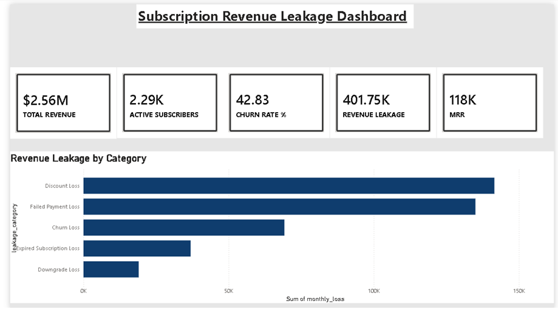

# Subscription Revenue Leakage — Analytics Dashboard


End-to-end project to identify, quantify, and reduce subscription revenue leakage.
**Pipeline: Python → SQL → Power BI.**

---

## Architecture

```
Python (synthetic data)        SQL / SQLite (analysis)        Power BI (dashboard)
──────────────────────         ───────────────────────        ────────────────────
01_generate_data.py     ─►     analysis_views.sql      ─►     Excel workbook + CSVs
  dim_customers                   13 analytical views            DAX measures
  dim_plans                       (one per dashboard section)    star-schema model
  fact_subscriptions      ─►   02_build_database.py     ─►     10 report pages
  fact_payments                   builds subscription.db
  fact_downgrades                 exports view CSVs
  fact_renewals                03_build_powerbi_workbook.py
```

## Folder structure

```
subscription_revenue_leakage/
├── python/
│   ├── 01_generate_data.py            # generates raw CSV tables
│   ├── 02_build_database.py           # loads SQLite, runs SQL, exports views
│   └── 03_build_powerbi_workbook.py   # assembles formatted Excel workbook
├── sql/
│   └── analysis_views.sql             # all 13 analytical views (10 sections + KPIs)
├── data/
│   ├── *.csv                          # raw fact/dim tables
│   └── subscription.db                # SQLite database
├── powerbi/
│   ├── Subscription_Revenue_Leakage_Data.xlsx   # ◄ import this into Power BI
│   ├── DAX_measures.txt               # paste these measures into Power BI
│   └── datasets/*.csv                 # individual view + table CSVs
└── README.md
```

## How to run

```bash
pip install pandas numpy openpyxl
cd python
python 01_generate_data.py          # 1. generate data
python 02_build_database.py         # 2. build DB + run SQL views
python 03_build_powerbi_workbook.py # 3. build Power BI workbook
```

## Building the Power BI dashboard

1. Open **Power BI Desktop** → *Get Data → Excel* → select
   `powerbi/Subscription_Revenue_Leakage_Data.xlsx` (or load the CSVs in `datasets/`).
2. In Model view, build the **star schema**: link `dim_customers[customer_id]`
   and `dim_plans[plan_id]` to the fact tables.
3. Create a blank table called `Measures`, then paste in the formulas from
   `DAX_measures.txt`.
4. Build the 10 report pages below using the corresponding sheets/measures.

### Suggested report pages
| Page | Visuals | Source |
|------|---------|--------|
| Executive KPIs | Cards: Total Revenue, MRR, ARR, Active Subs, Churn %, Retention %, Renewal %, Leakage, CLV | `KPI_Summary` |
| 1. Revenue Overview | KPI cards + revenue trend line | `v_revenue_overview`, fact_payments |
| 2. Failed Payments | Failure-rate line, by-plan bar, reason donut, recoverable-revenue card | `2_*` sheets |
| 3. Churn | Churn trend, churn-reason bar, MRR-lost cards | `3_*` sheets |
| 4. Expired | Missed ARR by segment/region matrix | `4_Expired` |
| 5. Downgrades | From→To plan flow, MRR lost | `5_Downgrades` |
| 6. Discount Leakage | Discount band vs net revenue, effective discount % | `6_Discount_Leakage` |
| 7. Retention | Retention/Renewal gauges, CLV card | `7_Retention` |
| 8. Leakage Root Cause | 100% stacked bar / waterfall of 5 categories | `8_Leakage_RootCause` |
| 9. Cohort | Cohort retention heatmap (signup month × retention %) | `9_Cohort` |
| 10. Recommendations | Text/insight cards | see below |

---

## Key findings (from the generated dataset)

> Figures below come from this synthetic dataset; they refresh automatically when you regenerate or replace the data with real records.

- **Total revenue collected:** ~$2.56M | **MRR:** ~$118K | **ARR:** ~$1.41M
- **Active subscribers:** 2,287 | **Churn rate:** ~42.8% | **Retention:** ~57.2% | **Renewal:** ~82.2%
- **Total revenue leakage:** ~$402K, split as:
  - **Discount Loss — 35.2%** (largest leak)
  - **Failed Payment Loss — 33.6%** (highly recoverable)
  - **Churn Loss — 17.2%**
  - **Expired Subscription Loss — 9.2%**
  - **Downgrade Loss — 4.7%**
- **Top failure reason:** Insufficient Funds (606 events, ~$65K at risk), then Card Expired and Card Declined.
- **Top churn reason:** Payment Failure (237 customers) — meaning a chunk of "churn" is actually involuntary and recoverable.

## Business recommendations

1. **Attack involuntary churn first.** Failed payments are the #2 leak *and* the #1 churn reason. Add smart dunning (retry on payday cycles), pre-expiry card-update prompts, and account-updater services — directly targets "Insufficient Funds" and "Card Expired."
2. **Audit the discount program.** Discounts are the single largest leak (~35%). Measure whether discounted cohorts actually retain/expand better; cap high (>30%) discounts and sunset promos that don't lift retention.
3. **Reduce voluntary churn.** "Too Expensive" and "Missing Features" dominate genuine cancellations — introduce a mid-tier/annual-prepay offer and a save-flow at cancel time.
4. **Recover expirations.** Strengthen renewal reminders (T-30/T-7/T-1) and auto-renew defaults; missed renewals are pure recoverable ARR.
5. **Limit downgrades.** Trigger usage-based outreach before downgrades; offer feature-based retention instead of price drops.
6. **Target high-risk segments.** Use the cohort + segment views to focus retention spend where CLV is highest and retention is weakest.

## Porting the SQL to other engines
The views are written in portable SQL. For **SQL Server / Postgres**, replace
SQLite date functions:
- `strftime('%Y-%m', d)` → `FORMAT(d,'yyyy-MM')` (SQL Server) / `to_char(d,'YYYY-MM')` (Postgres)
- `julianday(a)-julianday(b)` → `DATEDIFF(day,b,a)` / `(a::date - b::date)`
